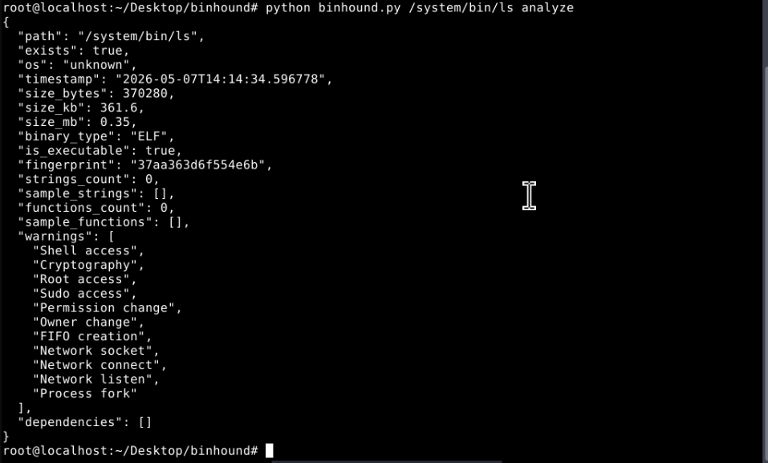

## Binhound



Binary analysis library for Termux, Linux, macOS, Windows.

## Install

```bash
git clone https://github.com/namauser/binhound
cd binhound
```

Usage

```bash
python binhound.py /system/bin/ls analyze
python binhound.py /system/bin/ls search-hex 7F454C46
python binhound.py /system/bin/ls search-string libc
python binhound.py /system/bin/ls compare /system/bin/cat
python binhound.py /system/bin/ls export
```

Output Example

```json
{
  "file": "/system/bin/ls",
  "size_mb": 0.35,
  "binary_type": "ELF",
  "fingerprint": "37aa363d6f554e6b",
  "warnings": ["Shell access", "Network socket", "Process fork"]
}
```

Features

· Extract strings from binary
· Find functions
· Detect suspicious patterns
· Compare two binaries
· Export to JSON report
· Works on Termux, Linux, macOS, Windows

Requirements

Python 3.6+ (no external dependencies needed)

MIT
```
Hexa
